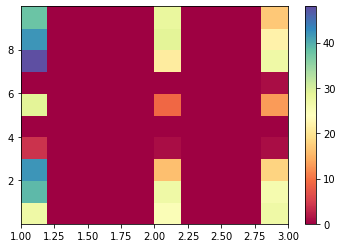

# RIP Vine

This app was written as part of Hack OHI/O 2019.

## Contributors
* [Ryan Schwartz](https://github.com/RyanSchw), Purdue
* [Dawson Moore](https://github.com/DMoore12), Purdue

## Goal
We aim to analyze the amount of "vine energy" new tik tok videos have. We complete this by using transfer learning to train a RNN classifier that classifies the amount of "vine energy" a sentence has. We leveraged Microsoft's cognitive services to convert an input video's speech to text for analysis. In addition, it also takes the sentiment of the tik tok (or any other video, using Text Analytics) to analyze the difference sentiment.

## Vine Classification
We found that a classifier could work ok for this problem even though there were limitations. Using [this](https://towardsdatascience.com/machine-learning-text-classification-language-modelling-using-fast-ai-b1b334f2872d) and [this](https://mc.ai/guide-to-text-classification-with-fastai/) tutorial, we found that we could take advantage of the transfer learning method to train an RNN classifier.

We took the following steps to create the classifier:
1. Use Azure speech-to-text to transcribe 200+ vines and manually classify
1. Sanitize / lemmatize data to remove stop words and simplify scale (from 1 - 10 to 1 - 3)
1. Verify distribution of 1/2/3 classification is roughly even (we had issues with classification when our 1s had 2x more than 2s and 3s)
1. Split into training/testing data and again verify that distribution is roughly even
1. Create language model and train language model learner
1. Create text classifier model from data and generate text classifier
1. Train text classifier model based on min loss divided by 10
1. Manually transcribed and classified another 250+ vines due to Youtube's download limitations (and repeated process)

In the end, we were able to train the model to the following specs:

epoch|train_loss|valid_loss|accuracy|time
---|---|---|---|---
0|1.308767|1.084773|0.442105|00:01

## Vine Sentiment
While the model was 44.2% accurate, we wanted to improve the accuracy without having to provide more data. We generated a report leveraging Azure's Text Sentiment analysis that analyzed the difference in sentiment between 1 classified Vines and 3 classified Vines.

We found that for each of the classifications on the x axis (1, 2, and 3), there actually was a slight difference in how a 1 classified quote on average tends to be more positive than not. We ran out of time to implement this, but planned on using this to further analyze the results of our neural network.

## Resources
- https://towardsdatascience.com/machine-learning-text-classification-language-modelling-using-fast-ai-b1b334f2872d
- https://mc.ai/guide-to-text-classification-with-fastai/
